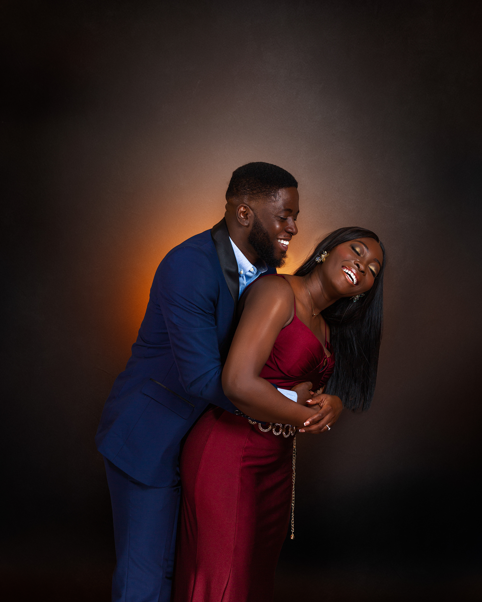
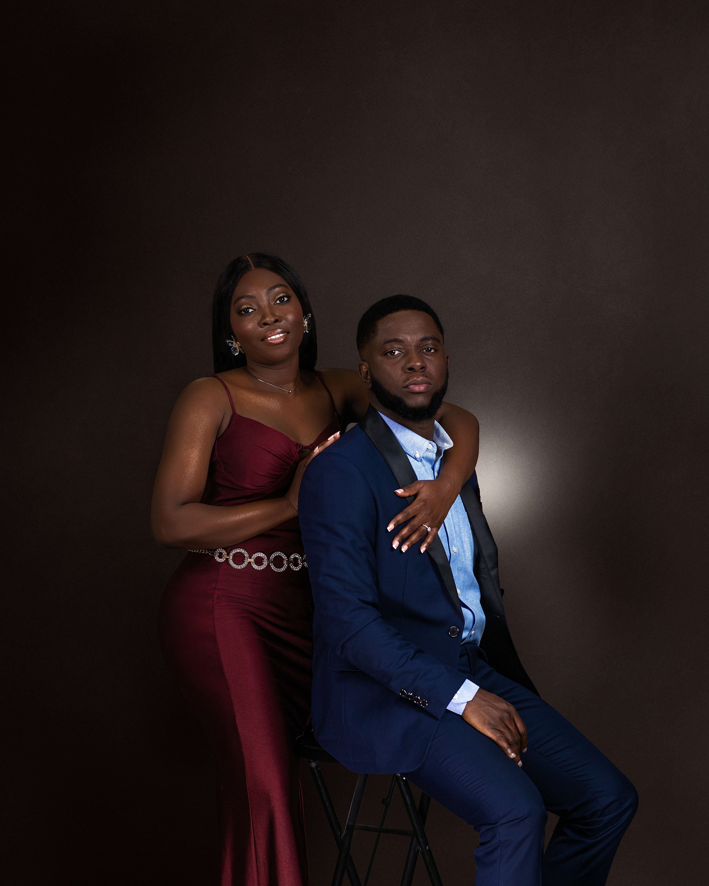
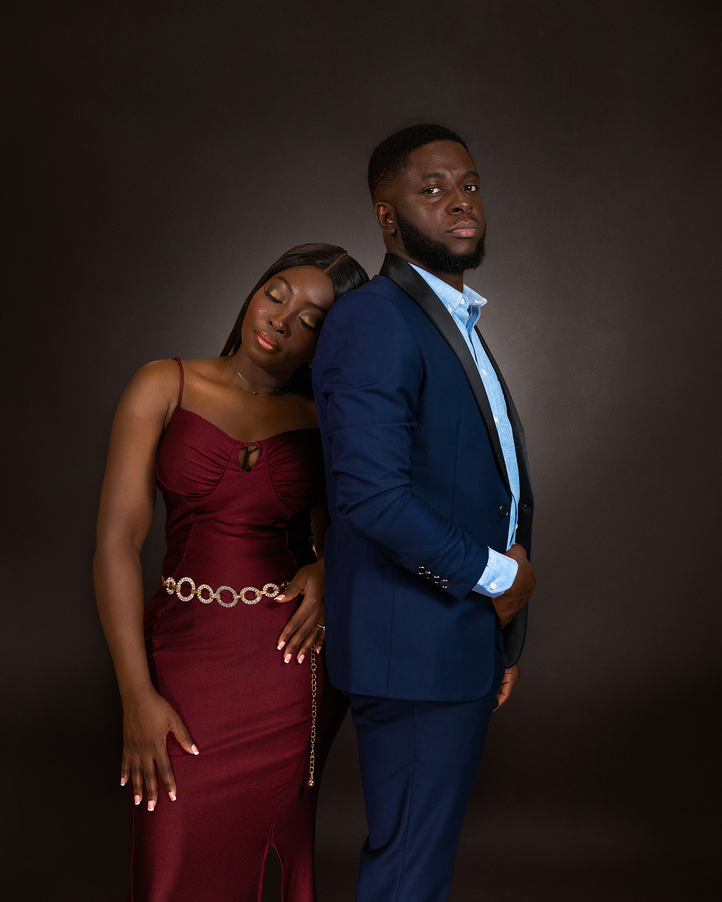
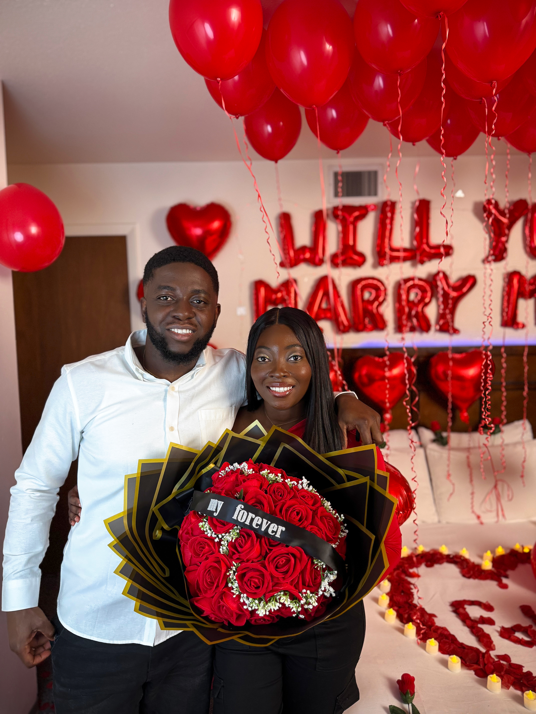
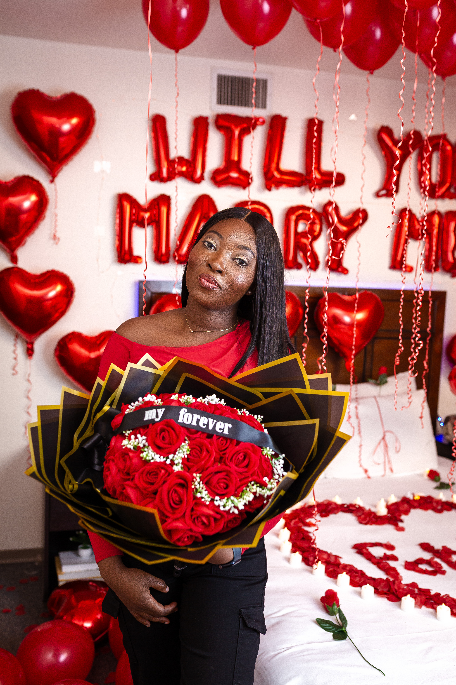
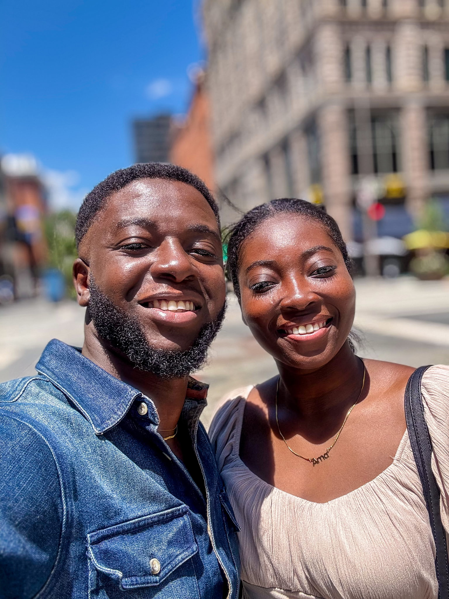
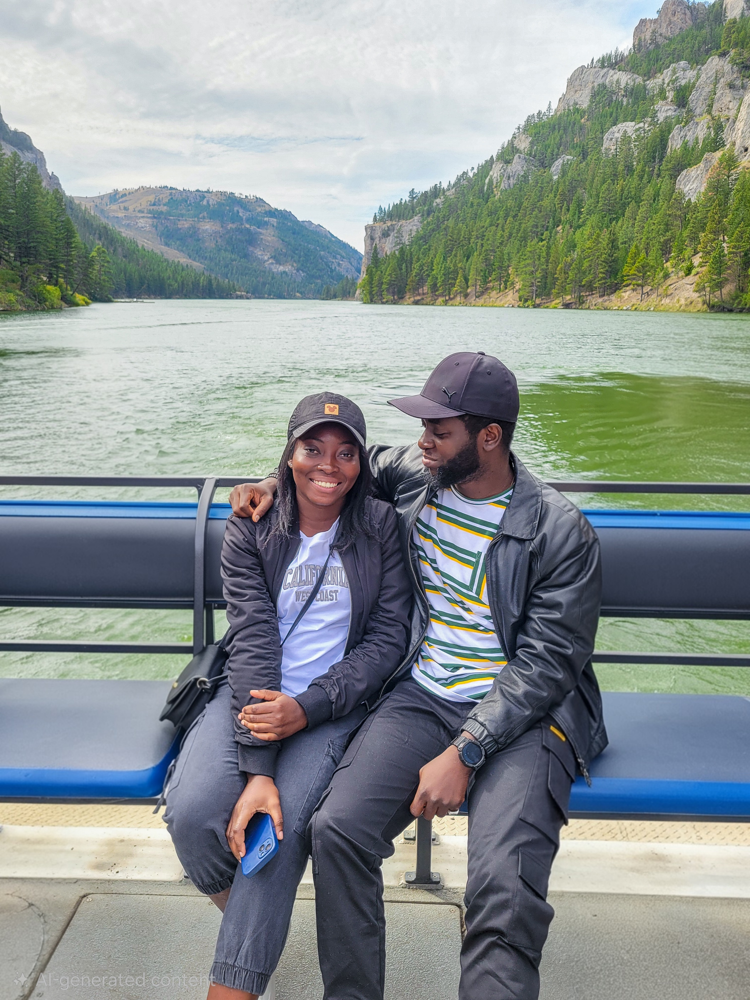
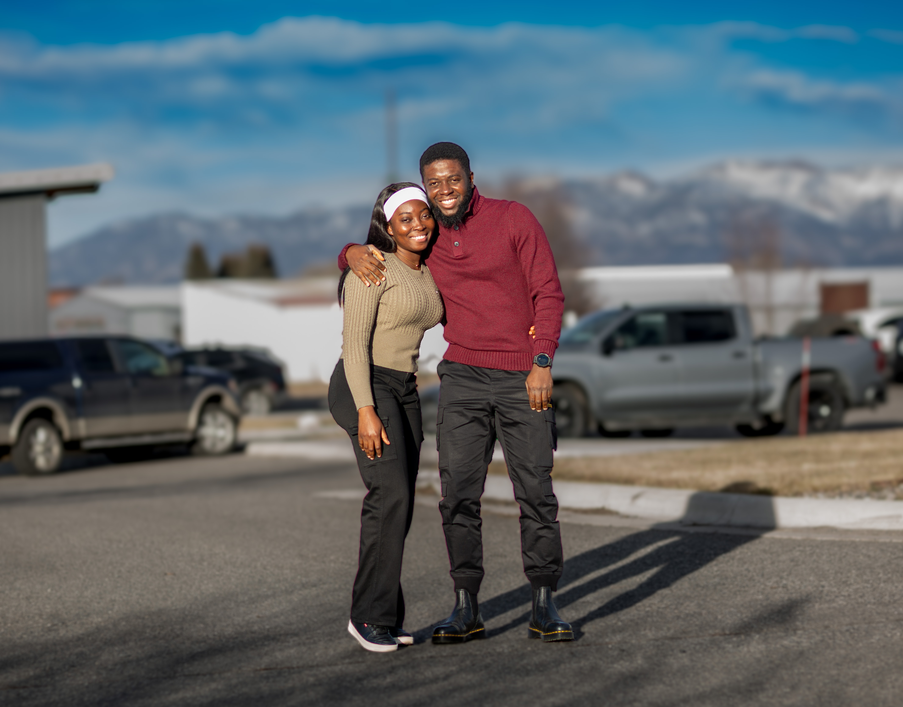

```{=html}
<section id="hero" class="hero">
  
  <div class="hero-slides">
    <div class="hero-slide active" style="background-image: url('assets/images/ma3.JPG');"></div>
    <div class="hero-slide" style="background-image: url('assets/images/ma3.JPG');"></div>
    <div class="hero-slide" style="background-image: url('assets/images/ma3.JPG');"></div>
    <div class="hero-slide" style="background-image: url('assets/images/ma3.JPG');"></div>
  </div>
  
  <div class="hero-overlay">
    <h1 data-aos="fade-up">Macbeth & Sarah</h1>
    <p data-aos="fade-up" data-aos-delay="200">May 29, 2026</p>
  </div>
  </div>
</section>
```


<!-- ```{=html} -->
<!-- <section class="love-bridge"> -->
<!--   <a href="#registry" class="love-button"> -->
<!--     <span class="love-heart">❤</span> -->
<!--     <span class="love-label">Send Your Love</span> -->
<!--   </a> -->
<!-- </section> -->
<!-- ``` -->


```{=html}
<section id="story" class="story-section">

  <div class="section-container">
  
  <h2></h2>

  <div class="story-image"></div>

  <div class="story-card">

    <h2>The Data Behind Us</h2>

    <div class="story-slider">

      <div class="story-slide active">
        <p>Mac and Sarah met in school. The initial conditions were simple. Same
      campus. Same discipline. One TA. One student. Zero expectations. At first,
      it was just that. A normal friendship that grew out of shared academic
      space. Nothing dramatic. No hidden variables. Just respect and an easy
      connection.</p>
      </div>

      <div class="story-slide">
        <p>Then life introduced a change in location. Mac moved to the United            States for graduate school and strongly recommended that Sarah apply as          well. For the record, this recommendation was not random. It was                 strategic. Sarah got admitted. Same school. Same department. At this             point, the sample size of shared experiences increased substantially.
        </div>
        
       <div class="story-slide"> 
      <p>Study sessions became frequent. So did conversations about faith,                family, and the kind of future they hoped for. The correlation was
         positive and getting stronger. The model was clearly shifting.</p>
      </div>

      <div class="story-slide">
        <p>What Sarah did not know was that Mac had been running a long-term analysis for quite some time. Quiet observation. Patient persistence. No premature conclusions. Eventually, the hypothesis was tested.</p>
      </div>

      <div class="story-slide">
        <p>Mac asked.</p>
        <p>Sarah said yes.<p>
        <p><strong>My statistically significant other!</strong></p>
      </div>
      
      
      <div class="story-slide">
      <p>Since then, we have been writing a story neither of us saw coming, but both of us now can’t imagine living without. <br>The rest of the data will be collected over a lifetime.<p>
      </div>
      

      <div class="story-controls">
        <button class="story-prev">←</button>
        <button class="story-next">→</button>
      </div>

    </div>

  </div>

</section>
```


```{=html}
<section id="details" class="section light-bg">
  <div class="container-fluid">
    <h2 data-aos="fade-up">Wedding Details</h2>
    <div class="cards">
      <div class="card" data-aos="fade-up" data-aos-delay="100">
        <p>May is a special month for us. We both celebrate our birthdays in May, and now
        we get to celebrate our marriage in May as well. It has become a chapter that
        holds some of our most important moments.</p>
      </div>
      <div class="card" data-aos="fade-up" data-aos-delay="200">
        <h3>Ceremony</h3>
        <p>
        We will be having our traditional wedding ceremony in Kumasi, Ghana 
        on Sunday, May 24, 2026.
        </p>

       <p>
       Our civil wedding will be on Friday, May 29, 2026, 
       at the Gallatin County District Court, MT, USA.
      </p>
      </div>
      </div>
    </div>
  </div>
</section>
```


```{=html}
<section id="save-date" class="gallery-section">

  <div class="save-grid">

    <!-- Top Left -->
    <div class="save-card">
      
    </div>

    <!-- Top Right -->
    <div class="save-card">
      
    </div>

    <!-- Bottom Left (Slideshow) -->
    <div class="save-card slideshow">
      <div class="save-slide active">
        
      </div>
      <div class="save-slide">
        
      </div>
      <div class="save-slide">
        
      </div>
    </div>

    <!-- Bottom Right -->
    <div class="save-card">
      
    </div>

  </div>

</section>
```


```{=html}
<section id="gallery" class="gallery-section">
  
  <h2></h2>
  
  <div class="gallery-wrapper">

    <h2>Moments We Love</h2>

    <div class="gallery-slider">
    
      <div class="gallery-slide">
        
        <p>This was February 14, the day Mac finally decided to stop analyzing and just
        ask Sarah to be his wife. </p>
      </div>
      
      <div class="gallery-slide">
        
        <p>And she said yesss!!! .</p>
      </div>
      
      <div class="gallery-slide">
        
        <p>The whole day felt light and joyful. It reminded us how far we have come and
        how much we have grown together.</p>
      </div>
      
      <div class="gallery-slide active">
        
        <p>We absolutely loved Salt Lake City. It has the beauty of the
        mountains and still feels like real city living. </p>
      </div>
      
      <div class="gallery-slide">
        
        <p>Our visit to Denver was nothing short of memorable. We had a
        long ten-hour drive from Bozeman to Denver. </p>
      </div>
   
     <div class="gallery-slide">
        
        <p>This photo was taken on a hotel rooftop with the Nashville
        skyline behind us. </p>
      </div>
      
      <div class="gallery-slide">
        
        <p>This photo was taken on the Missouri River at the Gates of the
        Mountains in Helena, Montana. </p>
      </div>

      <div class="gallery-slide">
        
        <p>This was us at MSU African Night in 2025. Matching braids.
        </p>
      </div>

      <div class="gallery-slide">
        
        <p>Here we were at our roommates’ commencement in May 2025. It was
        one of those moments filled with celebration and quiet
        goodbyes.</p>
      </div>

   
      <div class="gallery-slide">
        
        <p>This is us somewhere in Idaho. We may not remember the exact
        spot, but we definitely remember the good time.</p>
      </div>

      <div class="gallery-controls">
        <button class="gallery-prev">‹</button>
        <button class="gallery-next">›</button>
      </div>

      <div class="gallery-dots"></div>

    </div>

  </div>

</section>
```


```{=html}
<section id="registry" class="section light-bg">
  <div class="container center">
    <h2 data-aos="fade-up">Send Your Love</h2>
    <p data-aos="fade-up" data-aos-delay="100">
      We’re really just grateful to have you in our lives. That alone means
      everything to us.  If you’re able, please leave us a message. Your words
      will mean more to us than you know.
    </p>

    <div class="registry-buttons">
    
     <a href="https://forms.gle/KpVAWNhPwT6s635J8" target="_blank" class="wedding-btn message">
       Send a Message
     </a>
     <br>
      </p>If you would like to add a little something as
      we begin this next chapter, please use any of the options below.</p>
     
      <a href="https://paypal.me/nanamafobi" target="_blank" class="wedding-btn">
        PayPal
      </a>

      <a href="https://venmo.com/nanamafobi" target="_blank" class="wedding-btn">
        Venmo
      </a>
      
      <a href="https://cash.app/$nanamafobi" target="_blank" class="wedding-btn">
        CashApp
      </a>
    </div>
  </div>
  
</section>
```


```{=html}
<footer class="site-footer">
  © MacAmma, 2026
</footer>
```

